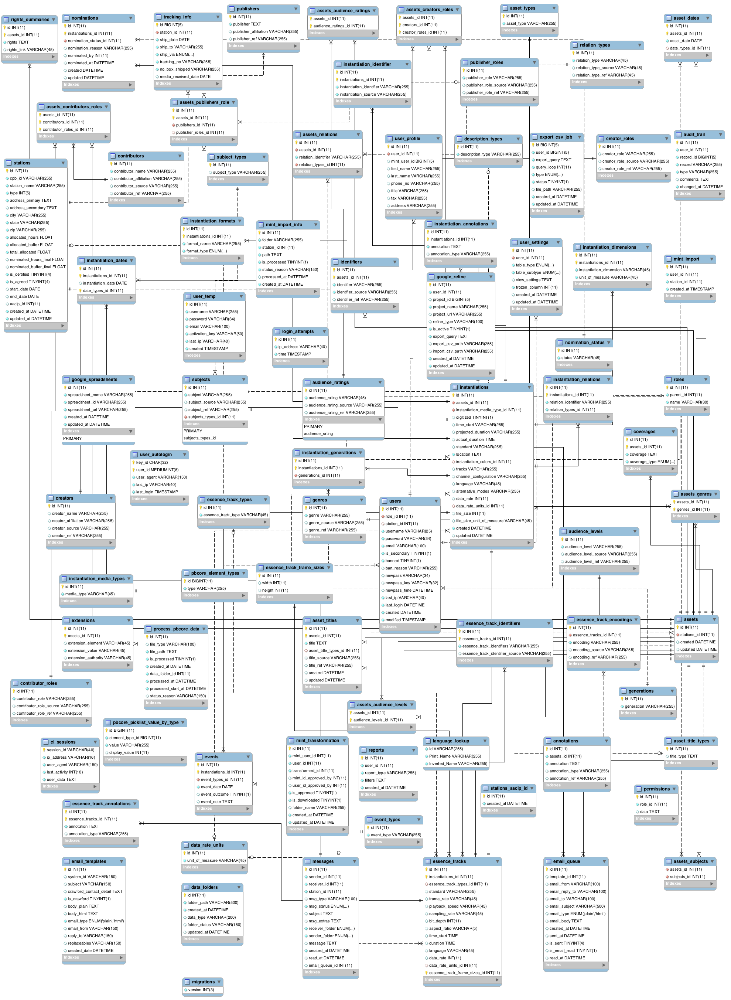

Installation and Configuration
===
[Back: Prerequisite](prerequisite.md)

**Assumptions**

* All the prerequisites are completed.
* Apache web directory /var/www/html
* Tomcat web directory /usr/share/tomcat6/webapps

AMS Application
----------
Application is build in PHP Framework **[CodeIgniter] (http://ellislab.com/codeigniter)**

**1) Goto apache web directory**

**2) Clone code from git using following command.**

	$ git clone git@github.com:avpreserve/AMS.git .

**3) Use mySQL dump file to initialize database with default schema.**
 
**Database ERD:**

**You can find source file for Entity Relation Diagram in documentation/database**

  File Path documentation/database/schema.sql
   
  **Steps to use schema in mySQL**

**Connection with mysql**

	mysql -h host -u username -ppassword

**Select database**

	use database_name

**Use default schema**

	source documentation/database/schema.sql

**4) Run phing command to configure application.**

	$ phing

And follow steps to configure environment,database and configuration values.

### OR Do Manually

**4) Run create_directory script. It will create required folders and set permissions.**

	$ sh create_directory.sh

Copy the index.php file from build/templates/index.php.build

	cp build/templates/index.php.build ./index.php

Copy the database.php file from build/templates/database.php.build

	cp build/templates/index.php.build ./application/config/database.php

Copy the config.php file from build/templates/config.php.build

	cp build/templates/index.php.build ./application/config/config.php

Now You have to manually set the values for these files.

**5) Application configuration variable (application/config/config.php)**

	$config['base_url'] = "https://domainname.com/";			Base URL of application

	$config['to_email'] = 'admin@domain.com';					Admin Email Address

	$config['from_email'] = 'noreply@domain.com';				Default email from when sending email

	$config['crawford_email'] = 'crawdford@crawford.com';		Crawford Email Address

	$config['path'] = '/var/www/html/';							Document Root of application path

	$config['cookie_domain'] = ".domain.com";					Cookie name

	$config['mint_url'] = "http://domain:8080/mint-ams";		Default MINT URL 

	$config['google_refine_url'] = "http://domain.com:3333";	Default Open Refine URL

	$config['instance_name'] = 'ams';							Instance type for MINT	

	$config['asset_index'] = 'assets_list';						Sphinx index name for assets

	$config['instantiatiion_index'] = 'instantiations_list';	Sphinx index name for instantiations

	$config['station_index'] = 'stations';						Sphinx index name for stations

	$config['google_spreadsheet_email'] = 'email@gmail.com';	Email address to get crawford spreadsheet data

	$config['google_spreadsheet_password'] = 'base64_encoded';	Password of email address (should be in base64_encode)

**6) Database configuration (application/config/database.php)**
	
	$db['default']['hostname'] = 'localhost';		Database host

	$db['default']['username'] = 'username';		Username to connect with database

	$db['default']['password'] = 'password';		Password to connect with database

	$db['default']['database'] = 'database_name';   Name of the database

	

[Next: Sphinx Configuration](sphinx-configure.md)	

